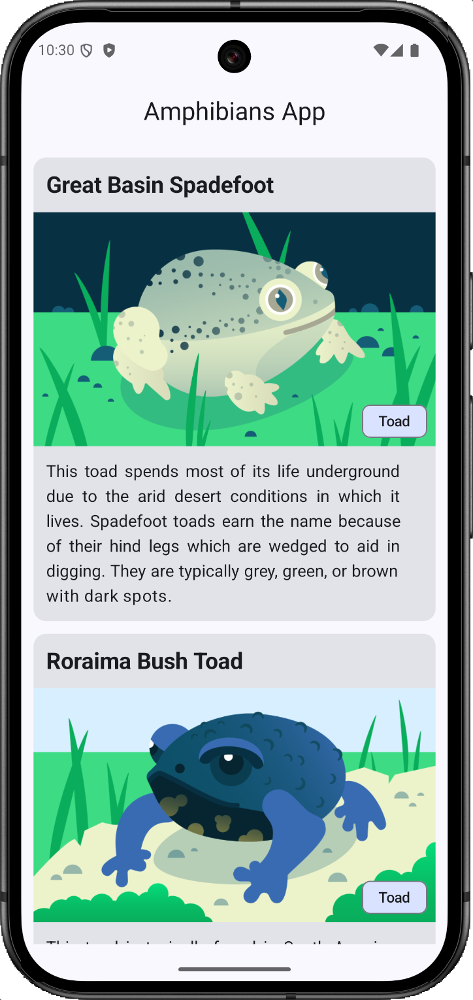

# 🐸 Amphibians App

An Android app that displays a list of amphibians with detailed information about each one. This project demonstrates modern Android development practices using Jetpack Compose and a clean app architecture.

## App Features
- **Amphibian List**: The app's home screen displays a scrollable list of amphibians, each with its name and a brief description.
- **Detailed View**: Tapping on an amphibian in the list navigates to a new screen that shows a full-screen image and a detailed description.
- **Error Handling**: The app includes basic error handling to display a message if the data cannot be fetched from the network.
- **Loading State**: A loading indicator is shown while the app is fetching data from the server.

## Implemented Technologies

This app was built using the following technologies and architectural patterns, which are central to modern Android development:

### Jetpack Compose 🎨
The entire UI of the app is built using Jetpack Compose, the modern declarative UI toolkit for Android.

### MVVM Architecture 🏗️
The app follows the **MVVM (Model-View-ViewModel) architecture** to ensure a clean separation of concerns.
- **UI (View)**: Composable functions that observe the state and display the data.
- **ViewModel**: Manages the UI state, handles app logic, and orchestrates data fetching.
- **Model**: Consists of the data layer, which includes the data models and the repository.

### Data Layer 💾
The data layer is responsible for providing data to the ViewModel.
- **Retrofit**: A type-safe HTTP client used to fetch JSON data from a remote web service.
- **Kotlinx Serialization**: A library used to deserialize the JSON response from the network into Kotlin data objects.
- **Repository Pattern**: A Repository class acts as a single source of truth for the app's data, providing a clean API for the ViewModel to get data without knowing where it comes from.

### Dependency Injection (Manual) 💉
The app uses a **manual dependency injection** approach to manage its dependencies.
- A custom Application class holds a single, global instance of an AppContainer.
- The AppContainer is a simple dependency container that creates and holds the AmphibiansRepository and AmphibiansApiService.
- Each ViewModel uses a custom ViewModelProvider.Factory to get its repository dependency from the AppContainer. This ensures that dependencies are provided cleanly and have the correct lifecycle.

### Asynchronous Operations 🚀
All network and data operations are handled asynchronously using Kotlin Coroutines. This ensures the app's main thread is never blocked, keeping the UI responsive and fast.

## Screenshots

